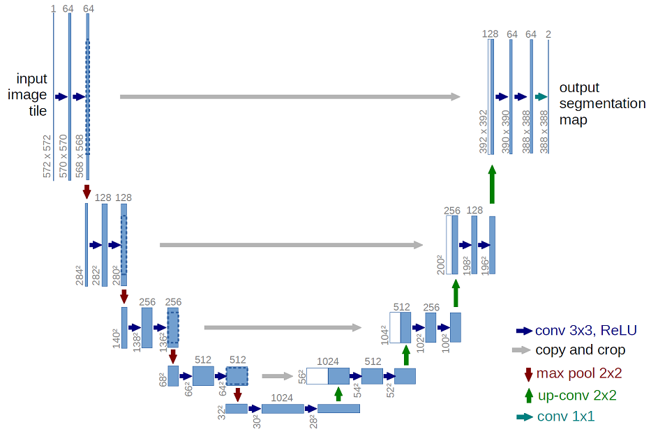
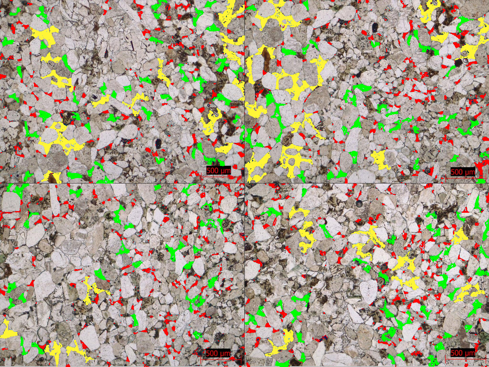

# Petrographic-Image-Segmentation
Project aimed to segment petrographic images taken from rock samples thin sections, in order to classify rock types.

The project will use an U-net segmentation architecture (https://arxiv.org/abs/1505.04597) implemented in Tensorflow Keras.

The idea is to start first with simple sandstone images to segment the principal minerals and porosity as a proof of concept and then continue to add segmentation of more sedimentary features to the model.

